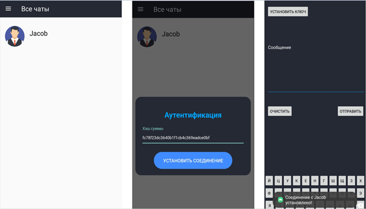

<header>
    <h1>Система защищенного обмена сообщениями в мессенджерах на базе платформы Android</h1>
</header>

    <h2>Содержание</h2>
    <ul style="font-size: 16px;">
        <li>
            <a href="#annotation">Аннотация</a>
        </li>
        <li>
            <a href="#description">Описание проекта</a>
        </li>
        <li>
            <a href="#technologies">Используемые технологии</a>
        </li>
        <li>
            <a href="#testing">Тестирование проекта</a>
        </li>
</ul>

<section>
    <h2 id="annotation">Аннотация</h2>
    
В выпускной квалификационной работе решается задача разработки системы защищенного обмена сообщениями в мессенджерах для мобильных устройств на базе платформы Android с возможностью шифровки и расшифровки сообщений. Для решения поставленной задачи созданы и объединены в единую систему программные модули, использующие криптографические алгоритмы защищенной передачи данных.
</section>

<section>
    <h2 id="description">Описание проекта</h2>
    
Система защищенного обмена в мессенджерах выполнена с целью продемонстрировать обмен информацией между пользователями в реальном времени через сеть Интернет при использовании криптографических алгоритмов защищенной передачи данных.

    
В разработанной системе выделяются следующие функциональные возможности:

    <ul>
        <li>регистрация/авторизация пользователя в системе;</li>
        <li>обмен контактными данными;</li>
        <li>сохранение полученной контактной информации;</li>
        <li>взаимная аутентификация, относящиеся к двум пользователям;</li>
        <li>выработка общего секретного сеансового ключа;</li>
        <li>генерация псевдослучайных последовательностей;</li>
        <li>формирование таблицы подстановки символов;</li>
        <li>шифровка сообщения перед отправкой пользователю;</li>
        <li>расшифровка полученного от пользователя сообщения. </li>
    </ul>
</section>

<section id="technologies">
    <h2>Используемые технологии</h2>
    <table>
        <tr style="border: 1px solid #fff">
            <td style="border-right:1px solid #fff">Android Studio</td>
            <td style="border-right:1px solid #fff">Java</td>
            <td style="border-right:1px solid #fff">Room Database</td>
            <td>OC Android</td>
        </tr>
    </table>
<section>

<section style="text-align:justify;">
    <h2 id="testing">Тестирование проекта</h2>
    
Для проведения тестирования реализованной системы, необходимо определить цели, которые должны быть успешно достигнуты:

    <ul>
        <li>
            <a href="#purpose_1">проверить регистрацию и авторизацию пользователя в системе;</a>
        </li>
        <li>
            <a href="#">обменяться контактными данными;</a>
        </li>
        <li>
            <a href="#">добавить контактные данные;</a>
        </li>
        <li>
            <a href="#">проверить взаимную аутентификацию;</a>
        </li>
        <li>
            <a href="#">выработать общий секретный сеансовый ключ;</a>
        </li>
        <li>
            <a href="#">сгенерировать псевдослучайную последовательность;</a>
        </li>
        <li>
            <a href="#">сформировать таблицу подстановки символов;</a>
        </li>
        <li>
            <a href="#">выполнить шифрование сообщения;</a>
        </li>
        <li>
            <a href="#">выполнить расшифровку сообщения.</a>
        </li>
    </ul>
    
В тестировании системы принимали участие пользователи Тиффани и Джейкоб.

    

        <h3 id="purpose_1">Цель тестирования №1</h3>
        
Проверить на работоспособность модуль «регистрации и авторизации».

        
Ожидаемый результат: успешная регистрация/авторизация пользователя в системе.

        
Входные данные: правильно заполненные поля «Логин» и «Пароль».

        
Процедура тестирования: при запуске системы отображается форма регистрации для ввода логина и пароля. Если у пользователя отсутствует учетная запись, он выполняет ввод необходимых данных (логин и пароль) и нажимает на кнопку «Зарегистрироваться». В случае успешной регистрации открывается окно, где отображается пустой список контактов и боковое меню с кнопками «Обменяться данными» и «Добавить контакт».  
Полученный результат (см. рис. 1.1) совпадает с ожидаемым.

        

            
            Рис. 1.1. Результат теста №1.1
        
  
        

        Если у пользователя уже имеется учетная запись, он выполняет ввод необходимых данных и нажимает на кнопку «Войти». В случае успешной авторизации открывается окно, где отображается пустой список контактов и боковое меню.  
Полученный результат (см. рис. 1.2) совпадает с ожидаемым.
        

        

            
            Рис. 1.2. Результат теста №1.2
        
  
    

    

        <h3 id="purpose_1">Цель тестирования №2</h3>
        
проверить на работоспособность модуль «обмена» контактными данными.

        
Ожидаемый результат: успешный обмен контактными данными между пользователями системы.

        
Входные данные: правильно заполненные поля «Логин» и «Пароль».

        
Процедура тестирования: при нажатии на кнопку «Обменяться данными» отображается форма, где необходимо ввести следующие данные: логин, пароль и случайно сгенерированное число, которое проставляется в поле для ввода автоматически.
        

        
Пользователь Тиффани в открывшейся форме заполняет текстовые поля своими контактными данными. При нажатии пользователем Тиффани на кнопку «Отправить данные» запустится проверка введенной информации на корректность и на соответствие с той информацией, которая уже сохранена в системе после регистрации. В случае успеха отображается список, где Тиффани необходимо выбрать мессенджер, через который она желает отправить свои контактные данные и конкретного пользователя, например Джейкоба.

        
Аналогичные шаги выполняет пользователь Джейкоб, который также в открывшейся форме заполняет текстовые поля своими контактными данными и уже после нажимает на кнопку «Отправить данные». В случае успеха Джейкобу отображается список, где ему необходимо выбрать мессенджер, через который он желает отправить свои контактные данные и конкретного пользователя, например Тиффани.

        
Полученный результат (см. рис. 1.3) со стороны пользователя Тиффани совпадает с ожидаемым.

        

            
            Рис. 1.3. Результат теста №2.1
        
  
        
Полученный результат (см. рис. 1.4) со стороны пользователя Джейкоба совпадает с ожидаемым.

        

            
            Рис. 1.4. Результат теста №2.2
        
  
    

    

        <h3 id="purpose_1">Цель тестирования №3</h3>
        
Проверить на работоспособность модуль «добавления» контактных данных.

        
Ожидаемый результат: успешное сохранение контакта в системе с последующим отображением в списке чатов.

        
Входные данные: правильно скопированная контактная информация от другого пользователя.

        
Процедура тестирования: при нажатии на кнопку «Добавить контакт» отображается форма, где необходимо ввести информацию, полученную через мессенджер от конкретного пользователя.

        
Пользователь Тиффани в открывшейся форме заполняет текстовое поле контактными данными (логин, пароль и случайно сгенерированное число) другого пользователя, например Джейкоба. При нажатии пользователем Тиффани на кнопку «Сохранить данные» выполняется сохранение контактной информации в системе. В случае успеха у пользователя Тиффани на главном экране в списке чатов появится новый контакт - Джейкоб.

        
Аналогичные шаги выполняет пользователь Джейкоб, который также в открывшейся форме заполняет текстовое поле контактными данными другого пользователя, например Тиффани и уже после нажимает на кнопку «Сохранить данные». В случае успеха у пользователя Джейкоба на главном экране в списке чатов появится новый контакт - Тиффани.

        
Полученный результат (см. рис. 1.5) со стороны пользователя Тиффани совпадает с ожидаемым.

        

            
            Рис. 1.5. Результат теста №3.1
        
  
        
Полученный результат (см. рис. 1.6) со стороны пользователя Джейкоба совпадает с ожидаемым.

        

            
            Рис. 1.6. Результат теста №3.2
        
  
    

    

        <h3 id="purpose_4">Цель тестирования №4</h3>
        
проверить на работоспособность модуль взаимной «аутентификации».

        
Ожидаемый результат: успешная взаимная аутентификация, относящиеся к двум сторонам, которые одновременно аутентифицируют друг друга.

        
Входные данные: правильно вычисленная хэш-функция на основе случайного числа и пароля пользователя.

        
Процедура тестирования: пользователь Тиффани в списке контактов выбирает другого пользователя по имени Джейкоб для того, чтобы убедиться в подлинности проверяемой стороны. После выбора контакта для Тиффани отображается форма для ввода хэш-функции, полученной от Джейкоба. Аналогичная форма, где необходимо ввести хэш-функцию, полученную от Тиффани, отображается и для Джейкоба. В случае успешной взаимной аутентификации открывается окно для общения с пользователем.

        
Полученный результат (см. рис. 1.7) со стороны пользователя Тиффани совпадает с ожидаемым.

        

            
            Рис. 1.7. Результат теста №4.1
        
  
        
Полученный результат (см. рис. 1.8) со стороны пользователя Джейкоба совпадает с ожидаемым.

        

            
            Рис. 1.8. Результат теста №4.2
        
  
    

    

        <h3 id="purpose_5">Цель тестирования №5</h3>
        
проверить на работоспособность модуль «выработки» ключа.

        
Ожидаемый результат: успешная выработка общего секретного ключа.

        
Входные данные: правильно заполненные поля «значения P и G и значение открытого ключа» и «значение открытого ключа контакта».

        
Процедура тестирования: пользователи (Тиффани и Джейкоб) решают выработать общий секретный ключ при нажатии на кнопку «Установить ключ». Далее пользователи решают между собой кто первым начнет формировать параметры для выработки ключа. Предположим, Тиффани решает это сделать первой нажатием на кнопку «Отправить данные». После нажатия запускается процесс формирования данных и отправки их Джейкобу, который в свою очередь эти данные сохраняет. После сохранения данных Джейкоб формирует свой публичный ключ и отправляет его Тиффани, а уже после нажимает на кнопку «Вычислить секретный ключ». Тиффани вставляет отправленный Джейкобом ключ в поле для вставки значения публичного ключа контакта и также нажимает на кнопку «Вычислить секретный ключ». В случае успеха вырабатывается общий секретный ключ, который будет использоваться в дальнейшем в качестве начального состояния для генератора.

        
Полученный результат (см. рис. 1.9) со стороны пользователя Тиффани совпадает с ожидаемым.

        

            
            Рис. 1.9. Результат теста №5.1
        
  
        
Полученный результат (см. рис. 1.10) со стороны пользователя Джейкоба совпадает с ожидаемым.

        

            
            Рис. 1.10. Результат теста №5.2
        
  
    

    

        <h3 id="purpose_6">Цель тестирования №6</h3>
        
проверить на работоспособность модуль «генерации» псевдослучайных последовательностей.

        
Ожидаемый результат: успешно сгенерированная псевдослучайная последовательность.

        
Входные данные: в качестве начального значения для генератора используется общий сеансовый ключ.

        
Процедура тестирования: после выработки общего секретного ключа запускается процесс формирования псевдослучайной последовательности. По окончании процесса итоговый результат преобразуется в двоичную последовательность.

        
Полученный результат (см. рис. 1.11) совпадает с ожидаемым.

        

            
            Рис. 4.11. Результат теста №6
        
  
    

    

        <h3 id="purpose_7">Цель тестирования №7</h3>
        
проверить на работоспособность модуль «формирования» таблицы подстановки символов.

        
Ожидаемый результат: правильно сформированная таблица.

        
Входные данные: сдвиг по таблице, который получается путем преобразования в десятичную систему счисления первых семи символов, образующих двоичную последовательность нулей и единиц из результата работы генератора псевдослучайных последовательностей.

        
Процедура тестирования: после того как генератор завершил свою работы запускается процесс формирования таблицы подстановки символов. По окончании процесса создается таблица с общим числом символов – 128 и диапазоном значений в двоичной системе счисления - от 0000000 (т.е. 0) до 0b1111111 (т.е. 127).

        
Полученный результат (см. рис. 1.12) совпадает с ожидаемым.

        

            
            Рис. 1.12. Результат теста №7
        
  
    

    

        <h3 id="purpose_8">Цель тестирования №8</h3>
        
проверить на работоспособность модуль «шифрования» сообщения.

        
Ожидаемый результат: успешное преобразование исходного сообщения в зашифрованную информацию.

        
Входные данные: сообщение пользователя в незашифрованном виде.

        
Процедура тестирования: при нажатии на кнопку «Операции» отображается выпадающий список, где необходимо выбрать соответствующую операцию.

        
Пользователь Тиффани после формирования сообщения в текстовом поле для Джейкоба нажимает на кнопку «Операции» чтобы открыть выпадающий список и выбрать необходимое действие. В открывшемся списке Тиффани выбирает операцию «Зашифровать» чтобы преобразовать сообщение в зашифрованный вид. После выполнения данной операции исходное сообщение пользователя в текстовом поле заменяется на зашифрованную информацию, которую Тиффани отправляет Джейкобу через конкретный мессенджер при нажатии на кнопку «Отправить».

        
Полученный результат (см. рис. 1.13) со стороны пользователя Тиффани совпадает с ожидаемым.

        

            
            Рис. 1.13. Результат теста №8
        
  
    

    

        <h3 id="purpose_9">Цель тестирования №9</h3>
        
проверить на работоспособность модуль «расшифровки» сообщения.

        
Ожидаемый результат: успешное преобразование зашифрованной информации в исходную и читабельную версию сообщения.

        
Входные данные: информация от пользователя в зашифрованном виде.

        
Процедура тестирования: при нажатии на кнопку «Операции» отображается выпадающий список, где необходимо выбрать соответствующую операцию.

        
Пользователь Джейкоб после получения в мессенджере сообщения от Тиффани копирует его в текстовое поле и нажимает на кнопку «Операции» чтобы открыть выпадающий список и выбрать необходимое действие. В открывшемся списке Джейкоб выбирает операцию «Расшифровать» чтобы преобразовать зашифрованную информацию в читабельную версию сообщения. После выполнения данной операции зашифрованная информация, полученная от пользователя и скопированная в текстовое поле заменяется на сообщение в понятном для чтения версии.

        
Полученный результат (см. рис. 1.14) со стороны пользователя Джейкоба совпадает с ожидаемым.

        

            
            Рис. 1.14. Результат теста №9
        
  
    

</section>
